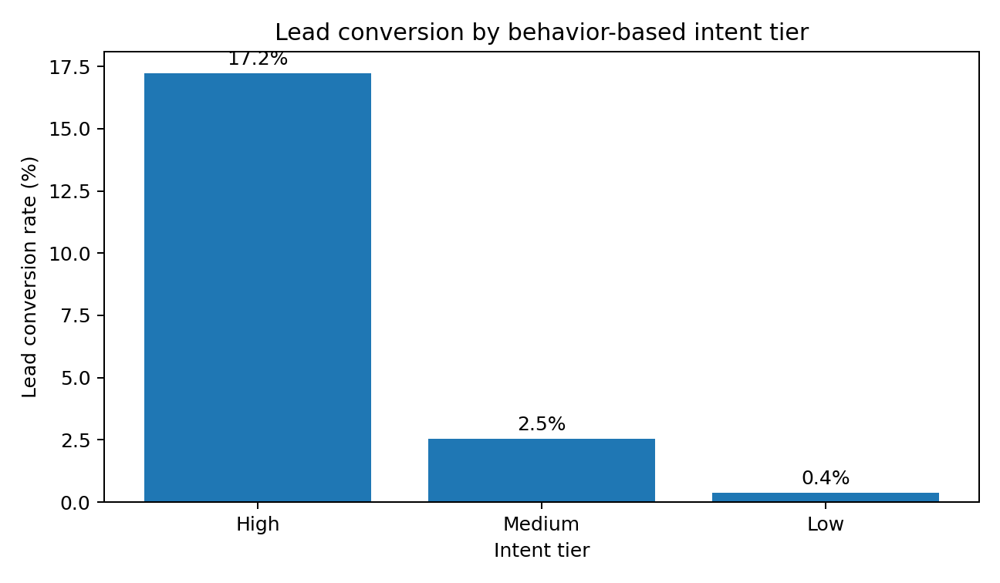
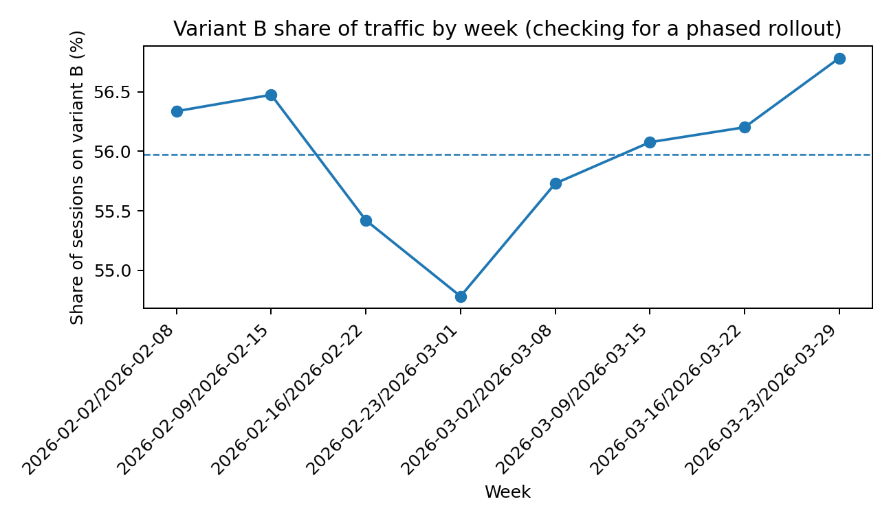
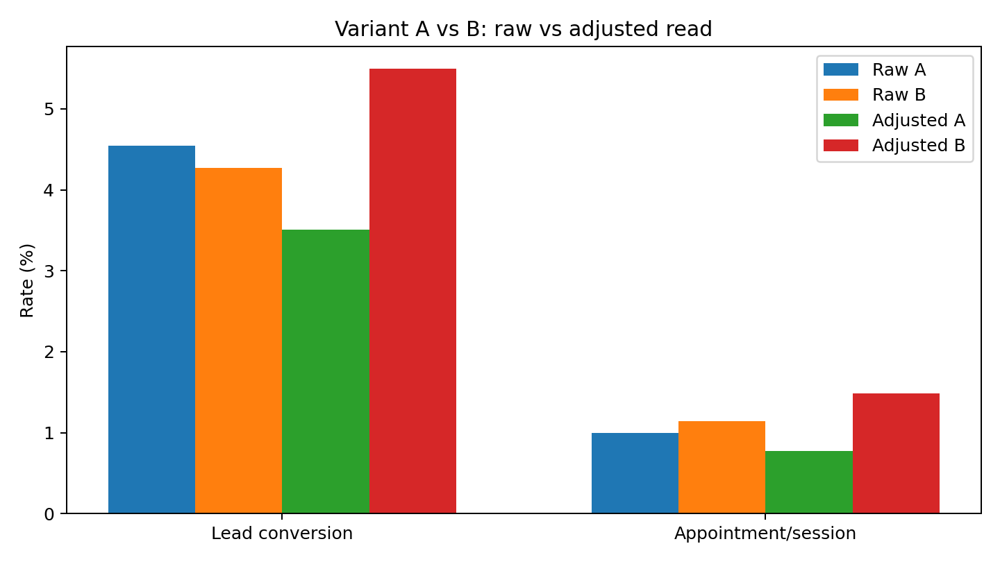
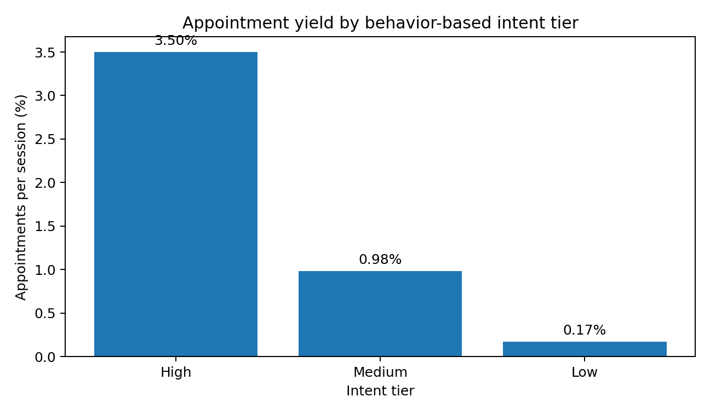
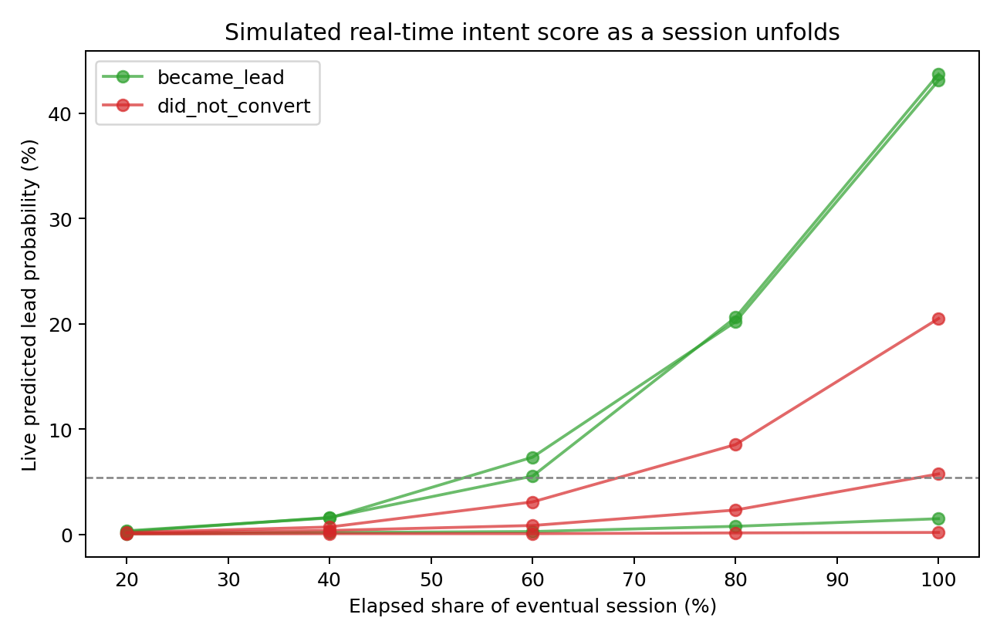

# Executive summary

Here's the short version: I scored every landing-page session on intent using only the behavior a visitor shows before they ever touch the form — how long they stayed, how far they scrolled, how many things they clicked, how many sections they saw, and how quickly they started scrolling. Nothing about the form itself, and nothing about which ad or channel brought them in. I wanted the segmentation to hold up on its own, not quietly become a proxy for "came from Google on desktop."

It works well. Once I dedupe the file, I'm left with 20,000 sessions, a 4.39% lead rate, 878 leads, and 216 booked appointments. Split those sessions into three tiers by predicted intent, and the top 20% convert at 17.2%. The middle 30% convert at 2.5%. The bottom half converts at 0.4%. That's roughly a 47x spread between the best and worst segment, and it's built entirely from pre-form behavior — no peeking at whether they actually submitted.

On variant B: don't roll it back based on the topline number. Raw conversion looks a touch worse for B, but that gap isn't statistically significant, and B is getting a much rougher traffic mix (way more mobile). Once I adjust for that, B comes out ahead on both lead conversion and appointment rate. My honest read is "the raw number is misleading, the adjusted number favors B, so don't kill it off a shaky signal" — not "B definitely wins, ship it forever."

And on lead quality: raw lead count isn't the whole story. High-intent visitors are still where most of the leads and appointments come from, so they should stay the priority. But once someone does convert, it's actually the medium- and low-intent leads that book appointments at a higher rate. That's worth folding into how CRO and media think about success — expected appointment value, not just lead count.

# Data, assumptions, and a few things I checked before trusting anything

Starting point is `lp_sessions.csv`: 20,040 rows. Forty of those are exact duplicates (same values across every column, including session_id), so I drop them, leaving 20,000 sessions for the analysis.

A couple of things about the columns worth flagging up front. `appointment_set` is only populated for sessions that converted — it's blank, not zero, for everyone who didn't submit the form. So when I talk about "appointment rate per session," non-converters count as zero appointments; when I talk about "appointment rate per lead," I'm only looking at the pool of people who actually converted. Those are two different questions and I keep them separate throughout. `scroll_depth_pct` and `time_to_first_scroll_sec` have a small amount of missing data (2% and 1.5% respectively), which I median-impute inside the model pipeline rather than drop.

I also want to be upfront that conversion is a proxy for intent, not intent itself — it's also picking up form friction, device UX, and how well-targeted the traffic was. I try to keep "how likely is this person to convert" separate from "how good is this lead once it converts," since those turn out to tell different stories later.

One more thing I checked: 105 sessions (about half a percent) last under a second. That's almost certainly bot traffic or accidental bounces, not real visits. I didn't strip them out of the main analysis — they should land in the Low tier anyway, since there's nothing there for the model to score — but I re-ran the tier summary excluding them just to be sure they weren't quietly propping up or dragging down the numbers. They weren't; everything moves by a tenth of a point at most (`outputs/tier_summary_excluding_bounces.csv`).

# How I built the segmentation

The ask was specifically for a *behavior*-based segmentation, so the features going into the model are:

- session duration,
- scroll depth,
- number of clicks,
- sections viewed,
- time to first scroll.

I fit a logistic regression to predict conversion from these five signals, and I scored every session out-of-fold across 5 folds — meaning each session gets scored by a model version that never trained on it. That matters more than it sounds: without it, the tier lift numbers would be flattering the model on data it already memorized, and this exercise is supposed to tell you whether the segmentation would hold up on the next batch of visitors, not just this one.

I didn't stop there, though — I also fit two other versions of the model, mostly to stress-test my own choice of features rather than to use them directly:

| Model                  |   ROC AUC |   Average precision |   Brier | What it's for                |
|:-----------------------|----------:|--------------------:|--------:|:------------------------------|
| Behavior-only pre-form |     0.886 |               0.312 |  0.035  | The actual CRO segmentation   |
| Behavior + context     |     0.89  |               0.321 |  0.0347 | Media/propensity benchmark    |
| Late-stage / leaky     |     0.999 |               0.988 |  0.0035 | Sanity check, nothing more    |

The context model (adding channel, device, geo, returning-visitor) barely beats the behavior-only one — 0.890 vs 0.886 AUC — which tells me channel mix isn't secretly doing the heavy lifting here; behavior really is carrying the signal. I'd keep that context version around as a benchmark for media/propensity work, but I wouldn't hand it to CRO as "visitor intent," because it partly reflects who Google or Facebook happened to send that day rather than what the person actually did on the page.

The third model is the one I built specifically to justify a decision, not to use. If I let the model see `form_started` and `form_field_interactions`, it gets almost suspiciously good (AUC 0.999) — because by the time someone's typing into the form, you already know they're converting. That's not a useful early signal, it's just a delayed readout of the outcome. Seeing that gap in black and white is why I feel good about excluding those fields from the real segmentation rather than just asserting "that would be leakage" and moving on.

# The tiers, and what they look like

I split the out-of-fold scores at the 50th and 80th percentiles — nothing fancier than that, since these are meant to be operational buckets a CRO team can act on, not a statistically "optimal" cut.

- **High** — top 20% of sessions, score >= 0.0543
- **Medium** — next 30%, score between 0.0115 and 0.0543
- **Low** — bottom 50%, score below 0.0115

| Tier   |   Sessions | Share  | Lead rate   | 95% CI            |   Leads | Appt / lead |   Appts | Appt / session |
|:-------|-----------:|:-------|:------------|:-------------------|--------:|:------------|--------:|:----------------|
| High   |       4000 | 20.0%  | 17.22%      | 16.09%–18.43%      |     689 | 20.3%       |     140 | 3.50%           |
| Medium |       6000 | 30.0%  | 2.53%       | 2.17%–2.96%        |     152 | 38.8%       |      59 | 0.98%           |
| Low    |      10000 | 50.0%  | 0.37%       | 0.27%–0.51%        |      37 | 45.9%       |      17 | 0.17%           |

If you slice even finer, the very top decile (10% of all sessions) converts at 25.9% — about 6x the site-wide average. The lift falls off fast after that:

|   Decile (1 = highest) |   Sessions | Lead rate   | Lift vs. base |   Leads | Appt / session |   Appts |
|---------------------:|-----------:|:------------|:----------------|--------:|:------------------|---------------:|
|                    1 |       2000 | 25.90%      | 5.9x             |     518 | 5.00%              |            100 |
|                    2 |       2000 | 8.55%       | 1.9x             |     171 | 2.00%              |             40 |
|                    3 |       2000 | 4.10%       | 0.9x             |      82 | 1.55%              |             31 |
|                    4 |       2000 | 2.15%       | 0.5x             |      43 | 0.65%              |             13 |
|                    5 |       2000 | 1.35%       | 0.3x             |      27 | 0.75%              |             15 |

# What actually separates these visitors

| Tier   | Median duration   | Median scroll   |   Median clicks |   Median sections | Median first scroll   | Form-start rate   |
|:-------|:------------------|:----------------|----------------:|------------------:|:-----------------------|:------------------|
| High   | 79.7s              | 72.0%            |               7 |                  5 | 2.71s                  | 44.6%              |
| Medium | 36.6s              | 46.7%            |               4 |                  4 | 3.66s                  | 19.2%              |
| Low    | 18.1s              | 20.9%            |               2 |                  2 | 5.61s                  | 6.6%               |

Nothing here is surprising once you see it, which is a good sign — clicks, scroll depth, and sections viewed are the strongest positive signals, and a slow first scroll is the clearest negative one:

| Feature                           |   Std. coefficient | Odds ratio / 1 SD   |
|:-----------------------------------|--------------------:|:----------------------|
| Clicks (log-scaled)                |                0.69 | 2.00x                 |
| Scroll depth                       |                0.67 | 1.96x                 |
| Sections viewed                    |                0.63 | 1.89x                 |
| Session duration (log-scaled)      |                0.34 | 1.41x                 |
| Time to first scroll (log-scaled)  |               -0.21 | 0.81x                 |

# Landing page B vs. A

## What the topline says

| Variant   |   Sessions | Lead rate   |   Leads | Appt / lead   |   Appts | Appt / session |
|:----------|-----------:|:------------|--------:|:---------------|---------------:|:----------------|
| A         |       8808 | 4.54%       |     400 | 22.0%          |             88 | 1.00%           |
| B         |      11192 | 4.27%       |     478 | 26.8%          |            128 | 1.14%           |

At face value, B's lead rate is a little lower. But the gap is small, and once you actually test it, it's not statistically significant:

| Metric              | A      | B      | B − A    | 95% CI                | p-value | Holm-adjusted p |
|:---------------------|:-------|:-------|:----------|:------------------------|----------:|------------------:|
| Lead conversion       | 4.54%  | 4.27%  | −0.27 pp  | −0.84 pp to +0.30 pp    |    0.352  |            0.665 |
| Appointment/session   | 1.00%  | 1.14%  | +0.14 pp  | −0.14 pp to +0.43 pp    |    0.332  |            0.665 |
| Appointment/lead      | 22.00% | 26.78% | +4.78 pp  | −0.90 pp to +10.46 pp   |    0.102  |            0.306 |

I ran three tests on overlapping data here, so I added a Holm-Bonferroni correction rather than quoting the raw p-values alone. It doesn't flip the conclusion — none of these were significant before the correction either — but it means the "not significant" claim actually holds up if someone pushes back on multiple comparisons, instead of relying on a single number that happens to clear 0.05.

## First, ruling out the obvious alternative explanation

Before I even get to device mix, there's a simpler question worth asking: is B actually a controlled split, or did it just get rolled out gradually — in which case "B vs A" might really be "later weeks vs. earlier weeks," and any seasonal or campaign shift would get blamed on the page. So I checked B's share of weekly traffic across the full eight-week window:

| Week                  |   Sessions | B share |
|:-----------------------|-----------:|---------:|
| Feb 2–8                |       2588 |   56.3%  |
| Feb 9–15               |       2479 |   56.5%  |
| Feb 16–22              |       2555 |   55.4%  |
| Feb 23–Mar 1           |       2530 |   54.8%  |
| Mar 2–8                |       2548 |   55.7%  |
| Mar 9–15               |       2559 |   56.1%  |
| Mar 16–22              |       2596 |   56.2%  |
| Mar 23–29              |       2145 |   56.8%  |

It barely moves — stays in a 54.8%–56.8% band the entire time, and a simple trend test on day index confirms there's no drift (p = 0.92). So this really is a concurrent A/B split running at roughly 45/55, not a phased rollout. Good — that rules out the simplest alternative story and means the real explanation is something else entirely.

## The real explanation: device mix

| Variant | Device  |   Sessions | Share |
|:---------|:---------|-----------:|:-------|
| A        | desktop  |       4403 | 50.0%  |
| B        | desktop  |       1987 | 17.8%  |
| A        | mobile   |       3705 | 42.1%  |
| B        | mobile   |       8899 | 79.5%  |
| A        | tablet   |        700 | 7.9%   |
| B        | tablet   |        306 | 2.7%   |

B is getting nearly 80% mobile traffic against A's 42%. Mobile sessions convert noticeably worse across the board, so B's raw number is being dragged down by a harder audience, not necessarily a worse page.

## Adjusting for it

I fit a logistic model predicting conversion from variant plus campaign, device, geo region, and returning-visitor status — all things determined before the visitor ever saw the page, so controlling for them doesn't erase any real effect the variant might have. What I deliberately didn't control for is on-page behavior (scroll, clicks, duration) — those could easily be a *consequence* of which variant someone landed on, and adjusting for a consequence of your own treatment would bias the estimate toward zero.

| Metric              | Adjusted A | Adjusted B | Adjusted B − A | OR (B vs A) | OR 95% CI       | p-value |
|:---------------------|:------------|:------------|:------------------|:--------------|:------------------|:----------|
| Lead conversion       | 3.51%       | 5.49%       | +1.98 pp           | 1.66x         | 1.43x – 1.94x      | <0.001  |
| Appointment/session   | 0.77%       | 1.48%       | +0.71 pp           | 1.94x         | 1.45x – 2.61x      | <0.001  |

Once the traffic mix is accounted for, B looks meaningfully better on both metrics, and both effects are clearly significant. My take: don't roll B back off the raw number. Keep it running, ideally with allocation rebalanced across device/source so a future read doesn't need this much untangling, or run a proper randomized test if there's time for one.

# What lead quality actually looks like

By raw volume, high intent is still doing most of the work:

- 689 of the 878 leads (about 4 in 5) come from the High tier.
- 140 of the 216 appointments come from High.
- High tier converts 3.5% of sessions straight into an appointment.

But flip the question to "of the people who convert, who actually shows up for an appointment," and the story reverses:

- High intent: 20.3% of leads book an appointment.
- Medium intent: 38.8%.
- Low intent: 45.9% — though that's only 37 leads total, so I wouldn't lean too hard on that exact number.

Traffic source tells basically the same story from a different angle:

| Source   |   Sessions | Lead rate  |   Leads | Appt / lead | Appts | Appt / session |
|:----------|-----------:|:------------|--------:|:--------------|--------:|:------------------|
| facebook  |      11944 | 1.22%       |     146 | 51.4%         |      75 | 0.63%              |
| google    |       8056 | 9.09%       |     732 | 19.3%         |     141 | 1.75%              |

Google brings in most of the volume. Facebook converts far fewer visitors into leads, but the leads it does produce book appointments at more than twice the rate. I wouldn't shift budget off Google without knowing CPA and revenue per appointment first — that's a different analysis — but I would change how success gets reported: expected appointment value, not raw lead count, is the number that should be driving optimization conversations.

# What I'd actually do with this

1. Put the behavior tiers into CRO reporting as a standard cut — lead rate, form-start rate, appointment/session, appointment/lead, sliced by tier, source, campaign, device, and variant.
2. Treat High intent as the priority for immediate conversion effort — it's both the biggest volume driver and the best appointment yield per session.
3. Use Medium intent as the main testing ground for CRO experiments — real engagement, real drop-off, and the most room to move: CTA placement, trust signals, shorter forms, reassurance copy.
4. Don't roll back variant B off the raw number. Keep it, ideally with cleaner allocation, or run a proper randomized test if there's appetite for one.
5. Shift the budget conversation from lead volume to expected value: P(lead) × P(appointment | lead) × appointment value, minus media cost.

# If this needed to run in real time

Everything above is about how a *finished* session behaved. The harder, more interesting version of this problem is scoring a visitor while they're still on the page, before they've filled anything in.

Here's roughly how I'd build toward that:

1. Stream page events as they happen — scroll milestones, clicks, section visibility, elapsed time — along with source/campaign/device context and returning-visitor status.
2. Keep a running session-state object with the same rolling features the model already uses: max scroll depth so far, click count so far, sections viewed so far, elapsed seconds, time to first scroll.
3. Score on meaningful events or short intervals, not on every single raw event — no need to re-score 50 times a second.
4. Launch it in shadow mode first, so you can check calibration and drift before it's allowed to trigger anything.
5. Require the score to clear a threshold *and* hold there for a minimum dwell time before it fires a signal — a hair-trigger on first crossing invites false positives.
6. Use separate models for the pre-form, form-started, and post-lead stages, so each one is answering the question it's actually equipped to answer.
7. A/B test any action the score triggers — sending an early signal to an ad platform or changing the page experience live is its own experiment, not a free rollout.

**A small working version of this.** Since `lp_sessions.csv` is one row per finished session and not an event log, there's no real sub-session ground truth to validate against here — so I built a small prototype instead of just describing one. `RealtimeIntentScorer` wraps the same fitted model and scores a session from whatever's known so far (elapsed time, scroll so far, clicks so far, sections so far). I then simulated six real completed sessions as if their behavior had built up roughly proportionally to elapsed time — a simplification, since real sessions burst and scroll unevenly, but enough to see the shape of it.

Two things came out of that that are worth flagging. First, the signal is real but not instant — one High-tier session that converted (`s_757669`) doesn't cross into "High" until 60% of the way through its own eventual length, climbing from a score of 0.003 to 0.44 as clicks and scroll build up. That's still well ahead of form submission, but it's an argument for requiring the score to hold steady for a bit, not firing the instant it crosses a line. Second, a couple of sessions (`s_287082`, `s_762375`) reach "High" by the end and never convert at all — which lines up with the tier table itself (High converts 17%, not 100%) and is the practical case for shadow mode: a live "High" reading is a probability update, not a promise, and it shouldn't drive spend or personalization until it's been checked against real outcomes.

To be clear about what this is and isn't: it's a proof of concept that shows the design translates into working code, not a validated real-time model. Getting to production would mean real event-level logging instead of interpolated behavior, feature computation that runs online, and calibration monitoring against actual sub-session outcomes.

# Where I'd push back on my own analysis

- This is a synthetic dataset, so I've tried not to over-read fine-grained quirks that wouldn't necessarily hold in the real system.
- Conversion is a proxy for intent, not intent itself — it's tangled up with form friction, device UX, and how well-targeted the traffic was to begin with.
- `appointment_set` only exists for leads, so "appointment per lead" is a conditional quality measure, not a full picture of every visitor's value.
- The B vs. A read is observational, not a randomized experiment. I ruled out a phased-rollout confound and the "not significant" raw reads survive a multiplicity correction, but an adjusted regression is still not the same thing as a clean, balanced test.
- The real-time section is a design plus a working proof of concept — not something I'd trust to drive real spend or bidding decisions without a proper event-level validation pass first.
